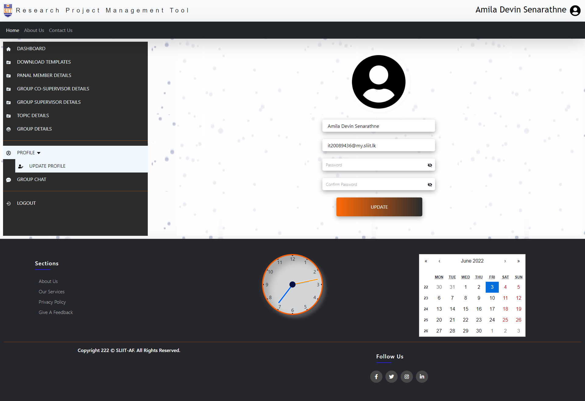
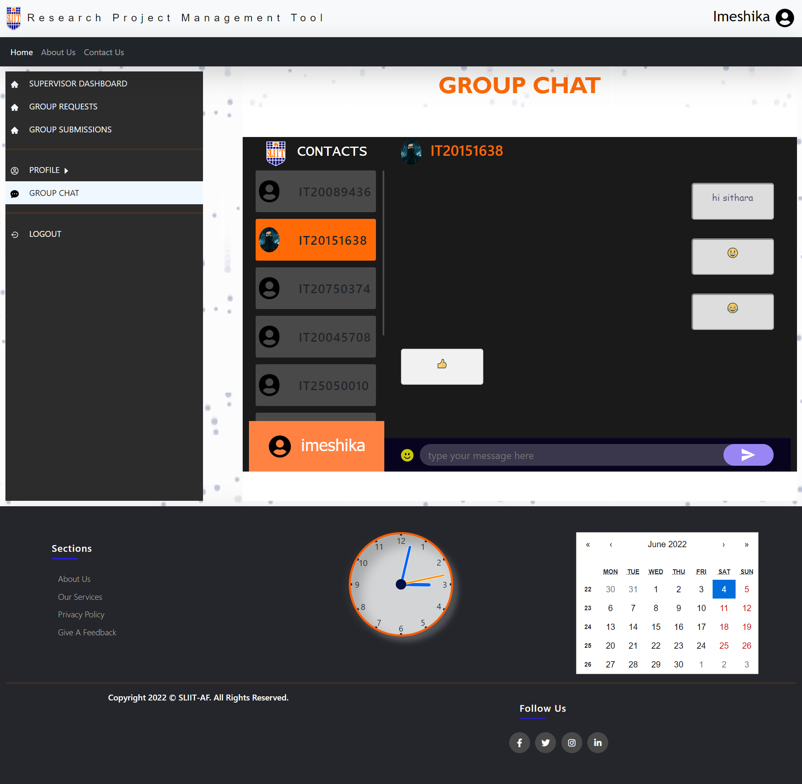

<div id="top"></div>

[![Contributors][contributors-shield]][contributors-url]
[![Forks][forks-shield]][forks-url]
[![Stargazers][stars-shield]][stars-url]
[![Issues][issues-shield]][issues-url]
[![MIT License][license-shield]][license-url]

<!-- PROJECT LOGO -->
<br />
<div align="center">
  <a href="https://github.com/amila1998/Research-Project-Management-Tool">
    
  </a>

  <h3 align="center">Research Project Management Tool
</h3>

  <p align="center">
    <a href="https://www.sliit.lk/"><strong>Sri Lanka Institute of Information Technology</strong></a>
    <br />
    Aplication Framework - SE3040
    <br />
    <br />
    <a href="zREAD_ME_DOCUMENTS/DOCUMENS/SE3040-2021-S1-Assesment02-Group-Project.pdf">Assignment 02 </a>
    <br />
    2022S1_REG_31
    <br />
    
  </p>
</div>

<!-- TABLE OF CONTENTS -->
<details>
  <summary>Table of Contents</summary>
  <ol>
    <li>
      <a href="#about-the-project">About The Project</a>
      <ul>
        <li><a href="#built-with">Built With</a></li>
      </ul>
    </li>
    <li>
      <a href="#getting-started">Getting Started</a>
      <ul>
        <li><a href="#prerequisites">Prerequisites</a></li>
        <li><a href="#installation">Installation</a></li>
      </ul>
    </li>
    <li><a href="#usage">Usage</a></li>
    <li><a href="#roadmap">Roadmap</a></li>
    <li><a href="#contributing">Contributing</a></li>
    <li><a href="#contact">Contact</a></li>
   
  </ol>
</details>

<!-- ABOUT THE PROJECT -->
## About The Project

All SLIIT undergraduates must do a research project in their 4th year. This Research Project 
module is a 16 credit, two semesters long project. A student group must find a research topic in 
a specific research field and send it to a supervisor who has interests in the same research field. 
Once the supervisor accepted the topic, they must find a co-supervisor of the same research 
interest.
After finalizing the supervisor student must send a document including the topic details of the 
Research. Then topic evaluation panel will evaluate the topic and send feedback to the student 
group. If the topic is accepted, they can continue to do the project. If rejected, they must find a 
new topic and submit it back.
There are several evaluation stages. Document submissions are evaluated by the supervisor or 
the co-supervisor. Presentations will be evaluated by a separate panel. The final Thesis will be 
Double evaluated by the supervisor and a blind reviewer.
SLIIT Research project team is looking for a system, which has the capability of managing the 
Research project and automating certain tasks.

User Classes
  * Admin
  * Student
  * Staff
      * Supervisor
      * Co-Supervisor
      * Panel Member
      
User Characteristics
  * Admin
      * Delete/Update users
      * Create submission types
      * Allocate panel members to student groups
      * Create marking schemes
      * Upload document/presentation templates
      * View Roles
  * Student
      * Register
      * Create student groups
      * Register research topic
      * Request supervisor
      * Request co-supervisor
      * Submit documents
      * Download Templates
  * Staff
      * Register
  * Supervisor / Co-Supervisor
      * Should be a staff member
      * Accept topics
      * Chat with the groups
      * Evaluate Documents submitted by groups using the provided marking scheme
  * Panel Member
      * Should be a staff member
      * Admin will add them to a panel
      * Evaluate topics
      * Evaluate students’ presentations according to the provided marking scheme


<p align="right">(<a href="#top">back to top</a>)</p>

### Built With

* [MongoDB](https://www.mongodb.com/) - MongoDB is a source-available cross-platform document-oriented database program. Classified as a NoSQL database program, MongoDB uses JSON-like documents with optional schemas. 
* [Express.js](https://expressjs.com/) - Express.js, or simply Express, is a back end web application framework for Node.js, released as free and open-source software under the MIT License. It is designed for building web applications and APIs. It has been called the de facto standard server framework for Node.js.
* [React.js](https://reactjs.org/) - React is a free and open-source front-end JavaScript library for building user interfaces based on UI components.
* [Node.js](https://nodejs.org/en/) - Node.js is an open-source, cross-platform, back-end JavaScript runtime environment that runs on the V8 engine and executes JavaScript code outside a web browser.

<p align="right">(<a href="#top">back to top</a>)</p>


<!-- GETTING STARTED -->
## Getting Started

### Prerequisites

1. Must have an Installed [Node.js](https://nodejs.org/en/) to your local machine
2. Must have a [MongoDB](https://www.mongodb.com/) Account
3. Must have a [Cloudanary](https://www.cloudimage.io/en/home) Account

### Installation

1. Clone the repo
   ```sh
   git clone https://github.com/amila1998/Research-Project-Management-Tool.git
   ```
3. Install NPM packages
   ```sh
     cd client 
     npm install
   ```
    ```sh
     cd server 
     npm install
   ```
4. Create `.env` file inside the server folder and Enter Following Keys
   ```.env
      MONGODB_URL = (your mongoDB Url)
      
      APP_SECRET=qwertyuiop
      APP_PORT=8000
      
      ACTIVATION_TOKEN=adwdawdawdaw
      REFRESH_TOKEN=ahbdahwdjawdj
      ACCESS_TOKEN=ajdwajwdn
      
      G_CLIENT_ID= ()
      G_CLIENT_SECRET = ()
      G_REFRESH_TOKEN= ()
      ADMIN_EMAIL= 2022s1reg31@gmail.com

      CLOUD_NAME=(Your Cloudanary Name)
      CLOUD_API_KEY=(Your Cloudanary Api Key)
      CLOUD_API_SECRET=(Your Cloudanary SECRET Key)
   ```
 5. To Run the server
      ```sh
        cd server
        npm run dev
       ```
 7. To Run the client
      ```sh
           cd client
           npm start
      ```
     

     
  Server Running on http://localhost:8000 <br/>
  Default Client Runnig on http://localhost:3000

<p align="right">(<a href="#top">back to top</a>)</p>


<!-- USAGE EXAMPLES -->
## Usage

<h3>Auth</h3>

<div align="center">
  
   
  
  
   
  
  
  

 
</div>

<h3>Student</h3>

<div align="center">
  
  
  
  
 
  
  
 
 
  
  
 
 
  
   
   
   
 
</div>

<h3>Supervisor</h3>

<div align="center">
 
 
 

  
</div>

<h3>Co Supervisor</h3>

<div align="center">
  
  
  
   
</div>

<h3>Panal Member</h3>

<div align="center">


</div>

 <h3>Admin</h3> 
<div align="center">
 
   
  
   
  
  
   
   
   
  
</div>


 <h3>Others</h3>
 
<div align="center">
  
  
</div>

<h3>Database</h3>
 
<div align="center">
  
</div>

<h3>Emails</h3>
 
<div align="center">
  
</div>

<p align="right">(<a href="#top">back to top</a>)</p>

<!-- CONTRIBUTING -->
## Contributing

Contributions are what make the open source community such an amazing place to learn, inspire, and create. Any contributions you make are **greatly appreciated**.

If you have a suggestion that would make this better, please fork the repo and create a pull request. You can also simply open an issue with the tag "enhancement".
Don't forget to give the project a star! Thanks again!

1. Fork the Project
2. Create your Feature Branch 
3. Commit your Changes 
4. Push to the Branch 
5. Open a Pull Request

<p align="right">(<a href="#top">back to top</a>)</p>

<!-- CONTACT -->
## Contact


Group Leader - [Wijesuriya W A D J K D - IT20750374](https://www.linkedin.com/in/kevin-wijesooriya-1b0197226/) - it20750374@my.sliit.lk

Member - [Senarathne S M A D - IT20089436](https://www.linkedin.com/in/amila-devin-37811b83/) - it20089436@my.sliit.lk

Member - [Udayantha Yapa Y M S - IT20045708](https://www.linkedin.com/in/sean-udayantha/) - it20045708@my.sliit.lk

Member - [Kumarasingha S N - IT20151638](https://www.linkedin.com/in/sithara-kumarasingha-161647229/) - it20151638@my.sliit.lk

Project Link: https://github.com/amila1998/Research-Project-Management-Tool

<p align="right">(<a href="#top">back to top</a>)</p>


<!-- MARKDOWN LINKS & IMAGES -->
<!-- https://www.markdownguide.org/basic-syntax/#reference-style-links -->

[contributors-shield]: https://img.shields.io/github/contributors/amila1998/Research-Project-Management-Tool.svg?style=for-the-badge
[contributors-url]: https://github.com/amila1998/Research-Project-Management-Tool/graphs/contributors
[forks-shield]: https://img.shields.io/github/forks/amila1998/Research-Project-Management-Tool.svg?style=for-the-badge
[forks-url]: https://github.com/amila1998/Research-Project-Management-Tool/network/members
[stars-shield]: https://img.shields.io/github/stars/amila1998/Research-Project-Management-Tool.svg?style=for-the-badge
[stars-url]: https://github.com/amila1998/Research-Project-Management-Tool/stargazers
[issues-shield]: https://img.shields.io/github/issues/amila1998/Research-Project-Management-Tool.svg?style=for-the-badge
[issues-url]: https://github.com/amila1998/Research-Project-Management-Tool/issues
[license-shield]: https://img.shields.io/github/license/amila1998/Research-Project-Management-Tool.svg?style=for-the-badge
[license-url]: https://github.com/amila1998/Research-Project-Management-Tool/blob/master/LICENSE.txt
[linkedin-shield]: https://img.shields.io/badge/-LinkedIn-black.svg?style=for-the-badge&logo=linkedin&colorB=555
[product-screenshot]: images/screenshot.png
