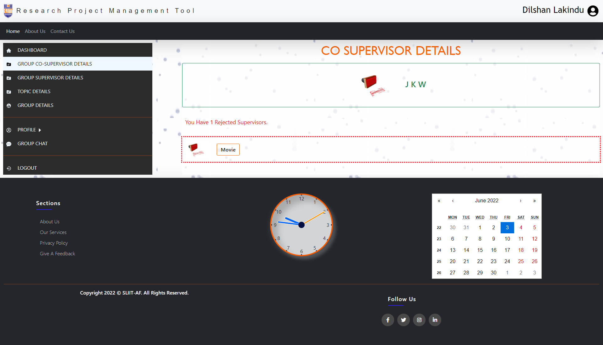
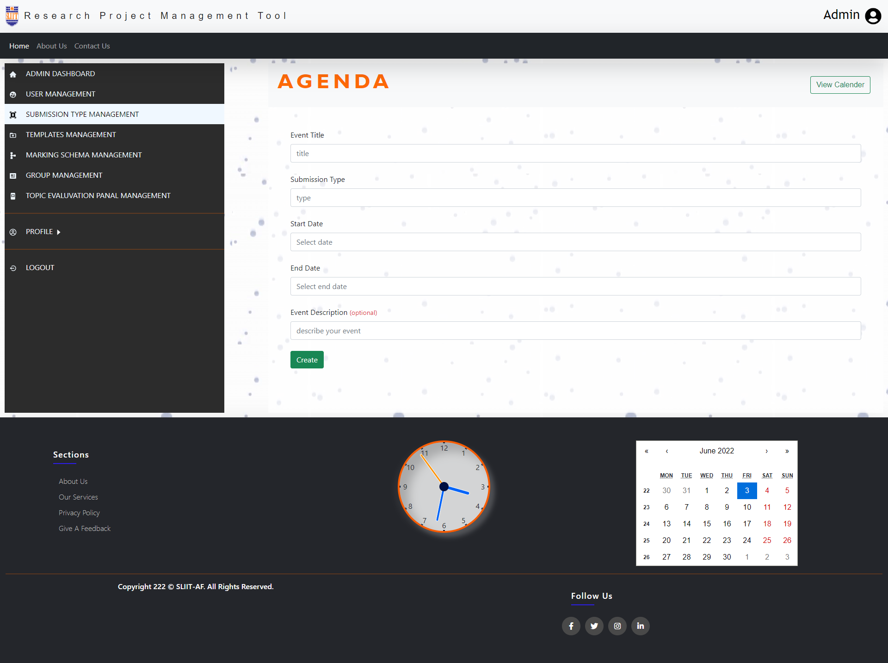

[![Contributors][contributors-shield]][contributors-url]
[![Forks][forks-shield]][forks-url]
[![Stargazers][stars-shield]][stars-url]
[![Issues][issues-shield]][issues-url]
[![MIT License][license-shield]][license-url]

<!-- PROJECT LOGO -->
 

  

  <h3 align="center">Research Project Management Tool
</h3>

  

    <a href="https://www.sliit.lk/"><strong>Sri Lanka Institute of Information Technology</strong></a>
     
    Aplication Framework - SE3040
     
     
    <a href="zREAD_ME_DOCUMENTS/DOCUMENS/SE3040-2021-S1-Assesment02-Group-Project.pdf">Assignment 02 </a>
     
    2022S1_REG_31
     
    
  

<!-- TABLE OF CONTENTS -->

  
Table of Contents

  <ol>
    <li>
      <a href="#about-the-project">About The Project</a>
      <ul>
        <li><a href="#built-with">Built With</a></li>
      </ul>
    </li>
    <li>
      <a href="#getting-started">Getting Started</a>
      <ul>
        <li><a href="#prerequisites">Prerequisites</a></li>
        <li><a href="#installation">Installation</a></li>
      </ul>
    </li>
    <li><a href="#usage">Usage</a></li>
    <li><a href="#roadmap">Roadmap</a></li>
    <li><a href="#contributing">Contributing</a></li>
    <li><a href="#contact">Contact</a></li>
   
  </ol>

<!-- USAGE EXAMPLES -->
## Usage

<h3>Auth</h3>

  
   
  
  
   
  
  
  

 

<h3>Student</h3>

  
  
  
  
 
  
  
 
 
  
  
 
 
  
   
   
   
 

<h3>Supervisor</h3>

  
  

 

<h3>Co Supervisor</h3>

<h3>Panal Member</h3>

 <h3>Admin</h3> 

 
   
  
   
  
  
   
   
   
  

 <h3>Others</h3>
 

  
  

<h3>Database</h3>
 

  

<h3>Emails</h3>
 

  

(<a href="#top">back to top</a>)

<!-- MARKDOWN LINKS & IMAGES -->
<!-- https://www.markdownguide.org/basic-syntax/#reference-style-links -->

[contributors-shield]: https://img.shields.io/github/contributors/amila1998/Research-Project-Management-Tool.svg?style=for-the-badge
[contributors-url]: https://github.com/amila1998/Research-Project-Management-Tool/graphs/contributors
[forks-shield]: https://img.shields.io/github/forks/amila1998/Research-Project-Management-Tool.svg?style=for-the-badge
[forks-url]: https://github.com/amila1998/Research-Project-Management-Tool/network/members
[stars-shield]: https://img.shields.io/github/stars/amila1998/Research-Project-Management-Tool.svg?style=for-the-badge
[stars-url]: https://github.com/amila1998/Research-Project-Management-Tool/stargazers
[issues-shield]: https://img.shields.io/github/issues/amila1998/Research-Project-Management-Tool.svg?style=for-the-badge
[issues-url]: https://github.com/amila1998/Research-Project-Management-Tool/issues
[license-shield]: https://img.shields.io/github/license/amila1998/Research-Project-Management-Tool.svg?style=for-the-badge
[license-url]: https://github.com/amila1998/Research-Project-Management-Tool/blob/master/LICENSE.txt
[linkedin-shield]: https://img.shields.io/badge/-LinkedIn-black.svg?style=for-the-badge&logo=linkedin&colorB=555
[product-screenshot]: images/screenshot.png
